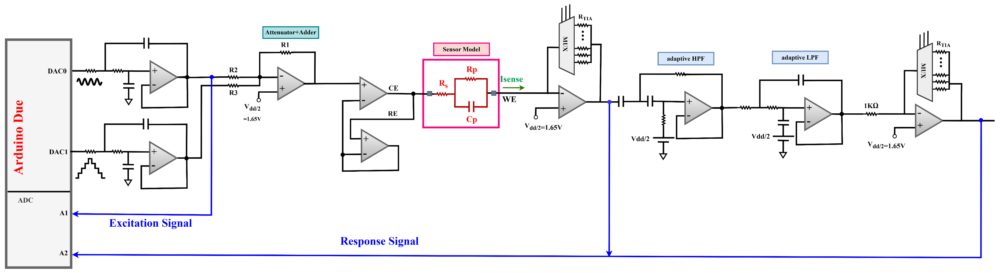
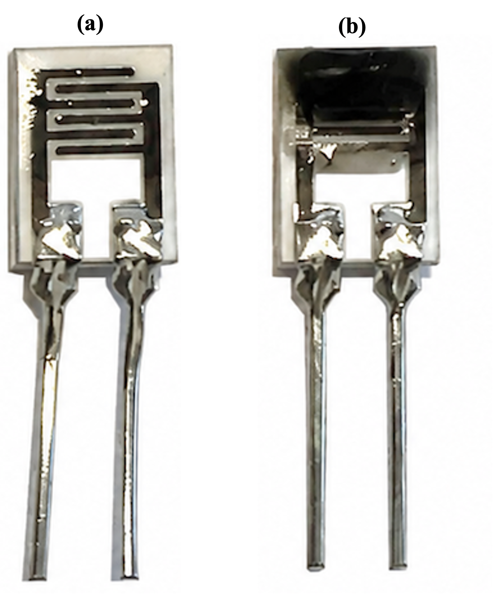
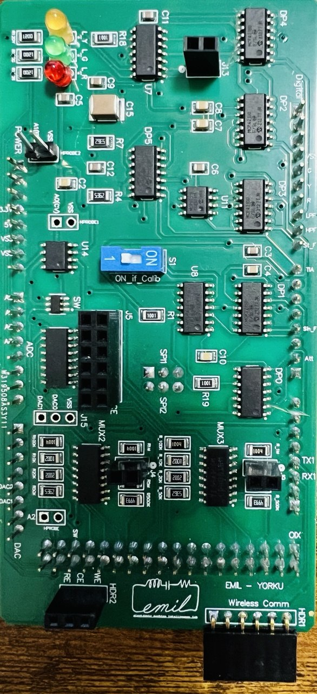
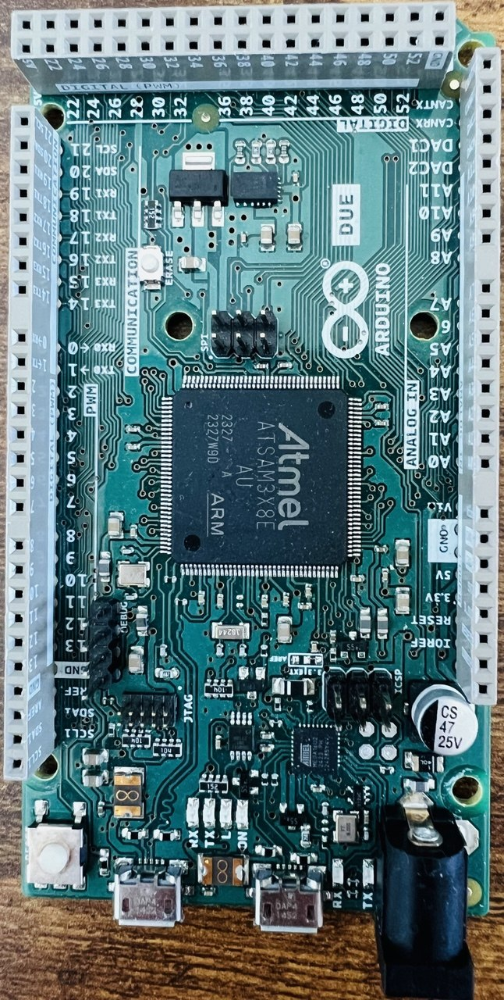
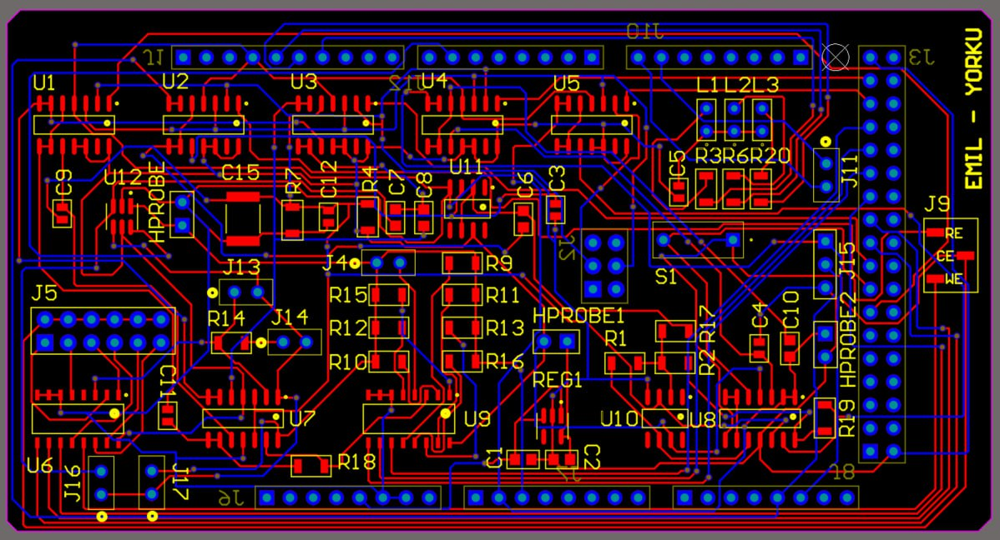
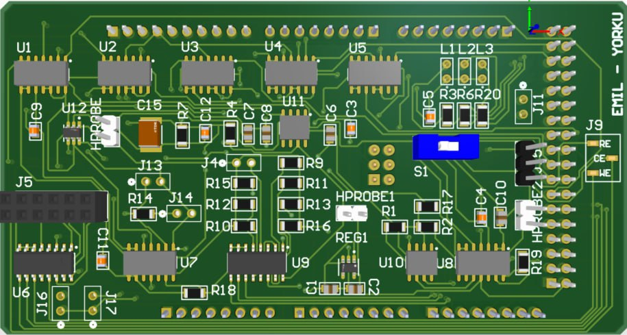

# Portable Impedance Readout System

Low-cost handheld reconfigurable impedimetric readout platform designed for gas detection and sensing applications.

The excitation signal is a 10mV peak-to-peak Sine wave superimposed on a DC staircase signal.
Then, the AC excitation signal and the response signal are read by the MCU to measure the impedance.

### System Overview:

Combines a low-amplitude AC sine wave with a DC staircase bias for impedance sensing

Arduino Due used with: DAC0 for AC sine wave, DAC1 for DC staircase

TIA converts sensor current to voltage

Adaptive Bandpass filter removes DC and boosts AC

Dynamic gain control selects the optimal feedback resistor to avoid saturation

### Challenges Addressed:

Signal saturation over dynamic DC levels by using adaptive Sallen-Key bandpass filters.

### Outcome:

Discrete analog system extracts real-time impedance magnitude and phase

Enables full-range impedance profiling across staircase bias levels

## Project Highlights
### Gas Sensor Readout IC Schematic(PAH Detection)

### Gas Sensor Readout PCB (PAH Detection)
Here's the IDE sensor:

PCB designed in Altium Designer.

### Arduino DUE

### PCB Layout in Altium Designer

### 3D-PCB Layout in Altium Designer

## Responsibilities

- Hardware architecture design
- PCB schematic capture
- PCB layout in Altium Designer
- Analog front-end integration
- Signal conditioning
- Embedded system integration
- Sensor interfacing
- System debugging and validation

## Features

- Portable handheld platform
- Reconfigurable gain/sensing paths
- Low-cost implementation
- Suitable for gas sensing and impedance measurements
- Real-time data acquisition

## Tools

Altium Designer | Embedded Systems | Analog Hardware | PCB Design | Cadence Virtuoso
