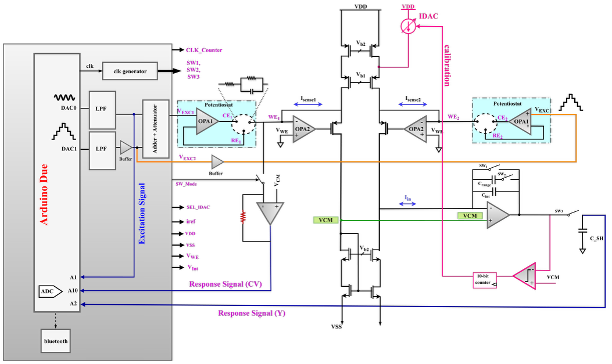

# Portable Impedance Readout System

Low-cost handheld reconfigurable impedimetric readout platform designed for gas detection and sensing applications.

## Project Highlights
### Gas Sensor Readout IC Schematic(PAH Detection)

### Gas Sensor Readout PCB (PAH Detection)

### Arduino DUE

### PCB Layout in Altium Designer

### 3D-PCB Layout in Altium Designer

## Responsibilities

- Hardware architecture design
- PCB schematic capture
- PCB layout in Altium Designer
- Analog front-end integration
- Signal conditioning
- Embedded system integration
- Sensor interfacing
- System debugging and validation

## Features

- Portable handheld platform
- Reconfigurable gain / sensing paths
- Low-cost implementation
- Suitable for gas sensing and impedance measurements
- Real-time data acquisition

## Tools

Altium Designer | Embedded Systems | Analog Hardware | PCB Design
